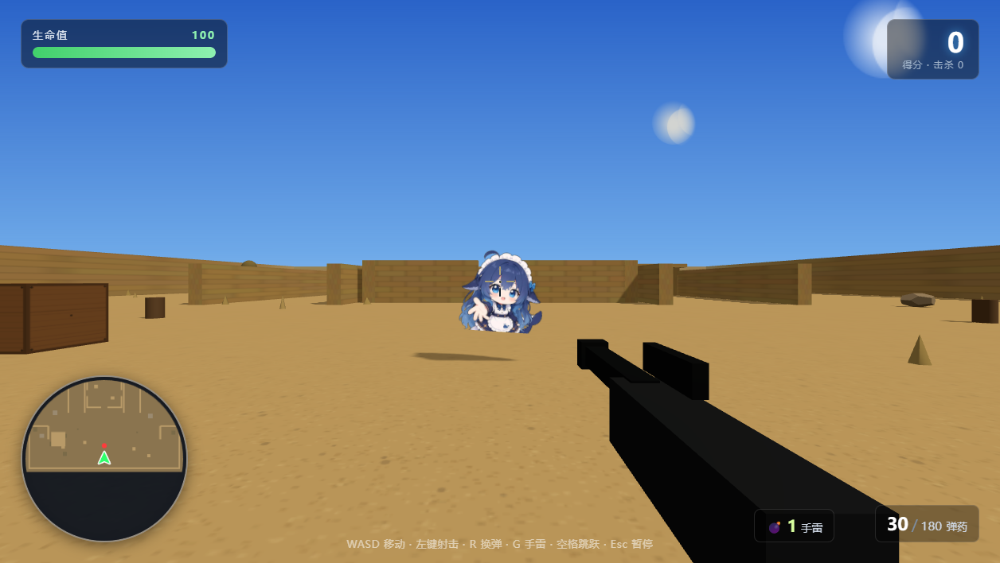
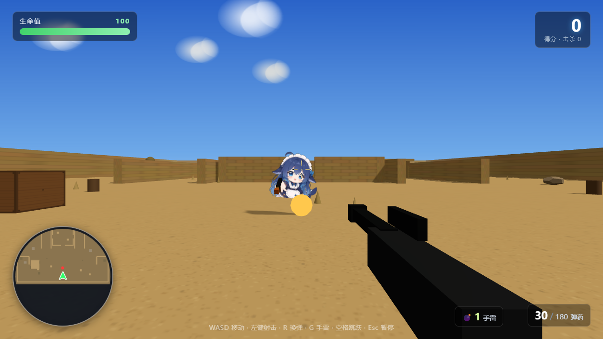
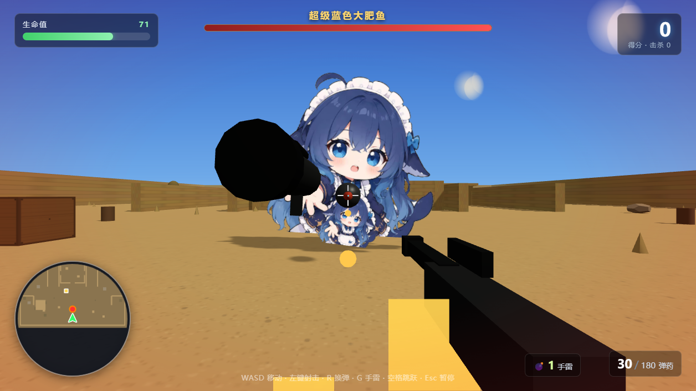

# 蓝色肥鱼大作战 🐟🔫

> **V 0.2.0-rc.5**（发布候选 5）· 基于 Three.js 的 3D 第一人称射击游戏
> （v0.2 系列：连杀评级、局内强化与敌人成长、护甲道具、技能面板、五场景 BGM 体系、
>  开发者模式全套 —— 秘技/调试日志/技能编辑/自毁/作弊被抓；本轮 rc.5 为发布候选整理版）
> 零构建、零依赖、单页面启动、离线可玩 —— 双击 `index.html` 开打！


## 📖 简介

一群「蓝色大肥鱼」占领了沙漠城——它们会在天空中巡逻、发现你后疯狂逼近，
其中有些还**端着枪**！消灭它们、猎杀巨型 Boss、清理补给、活着拿到最高分。

**V0.2 开启"局内成长"循环**：击杀 Boss 后 **3 选 1 技能强化**（子弹威力 / 弹药回收 / 吸血再生 / 手雷补给 / 疾风步伐，
各自独立 10 级，死亡重来不继承）——敌人也会每只 Boss 变强（小怪血厚攻高、Boss 更硬更快、炮弹更痛、刷新更密），
配合 **连杀评级**（D→C→B→A→S→SS→SSS，2 秒无击杀降一级）、**护甲道具**（15 层封顶，每层减 2 伤）、
**Boss 血条数值**直观成长，以及 **5 首场景音乐**（菜单/主曲/Boss 战/奖励/战败随场景无缝切换）——
直到五个技能全部满级，**再击杀 Boss 即通关无尽模式**！

## 🎮 启动方式

| 方式 | 操作 |
| --- | --- |
| **直接玩** | 双击 `index.html`（推荐 Chrome / Edge，无需服务器、断网可玩）<br>流程：开始游戏 → **关卡选择**（闯关模式敬请期待 / 无尽模式—沙漠城）→ 进入沙漠城 |
| **本地服务器** | 双击 `启动游戏.bat`（或 `node server.js` 后访问 `http://127.0.0.1:8123/`） |

## ⌨️ 操作

| 按键 | 功能 |
| --- | --- |
| W A S D | 移动（支持方向键） |
| 鼠标 | 瞄准 / 左键射击（可按住连发） |
| R | 换弹（弹夹 30 发、备用 180 发，1.5 秒） |
| G | 手雷（落地即爆，半径 4 米） |
| I | 技能等级面板（查看本局限时强化等级，打开时游戏暂停；再按 I 或 Esc 关闭） |
| 空格 | 跳跃（可跳上箱子/石头/高台） |
| Esc | 暂停 |
| 💡 秘技 | 5 秒内按 **WWSSAADDBABA** 进入/退出**开发者模式**（生命/上限 99999、每 5 秒回 100 血，
  左侧显示伤害/击杀 Debug 日志，"上上下下左左右右BABA"梗）
| 💀 自毁 | **开发者模式下** 4 秒内按 **KILL**：退出开发者模式并自杀（结算"你选择了自我了断…"） |

## 👾 敌人图鉴

### 1. 普通近战鱼
巡逻 → 发现玩家 → **1.5 倍速**追击咬人（15~25 随机伤害），中枪即消失（每条 +10 分）。
> ⚠️ **成长**：每击杀一只 Boss 小怪血量 +1（≤10）；血量到 10 后攻击力每 Boss +1（近战 ≤50）。
> 攻击判定为**三维距离**——站上箱子/顶棚/高台，近战怪咬不到你！



### 2. 远程射手鱼（50% 概率生成）
外观与普通鱼相同，**但手里端着金橙色的枪**——发现玩家后向前推进 1 米站桩开火，
**每秒 2 发子弹**（每发 7~12 伤害）。贴脸绕后是它的软肋。
> ⚠️ **成长**：攻击成长时每颗子弹 +1（≤30 伤害）。



### 3. Boss「超级蓝色大肥鱼」
- 首次 30 秒**必定出现**；此后 50% 概率判定，连续 3 次未出**保底必刷**（场上唯一）
- **3 倍体型、1.2 倍速度**、手里端着**火箭筒**
- 发射 **7 m/s 半跟踪炮弹**（命中扣 25）；炮弹落地/撞墙会爆炸（半径 2 米、仅伤玩家、威力 -10%）
- **炮弹可被射击**——打中 3 发使炮弹空爆，空爆对敌我通用！
- 击败后：**生命回满 + 60 发备弹 + 随机 1~3 颗手雷**（另 +50 分）



## ✨ 玩法特性

- **沙漠城地图**：约 90×90 米——中央建筑、东西长廊（含 B 洞顶棚）、A/B 开阔广场、绿洲水池、箱堆掩体
- **小地图**（左下角圆形、随视角旋转）：绿箭头=你、红点=敌人、橙圈= Boss、黄方块=弹药箱、红十字=医疗包
- **局内强化（无尽模式）**：击杀 Boss 后弹出 **3 选 1 奖励窗口**（选择前游戏暂停），
  五种技能可各升 10 级——子弹威力 / 击杀回弹 / 击杀回血 / 击杀掉雷 / 移动速度；
  技能满级后不再出现，**全部满级后再击杀 Boss 即通关无尽模式**（独立成长，死亡/退出不继承）
- **敌人成长**：每击杀一只 Boss——小怪血量 +1（≤10，到顶后攻击 +1，近战 ≤50 / 射手 ≤30）、
  下一只 Boss 血量 +5（≤100）、Boss 炮弹伤害 +2（≤60）、小怪生成速率 +5%
- **护甲道具**：每 10 秒 25% 概率生成（生成时屏幕提示），每拾取一次 = **+1 层护盾**（每层防御力 **2 点**，
  即减免 2 点所受伤害），最高 **15 层 = 30 点减免**，满层后停止生成；小地图显示为青色圆帽淡蓝描边图标
- **Boss 血条数值**：血条上实时显示「当前血量 / 血量上限」，直观看到每局 Boss 上限的成长变化
- **Boss 成长**：每只 Boss 血量下一只 +5（15→20→25…≤100）、炮弹伤害每只 +2（≤60）
- **连杀评级**：连续击杀累计连杀点数（普通鱼 +1 / Boss +5），
  评级 D→C→B→A→S→SS→SSS 逐级飙升；评级字母常驻显示在右侧黄金分割位，
  升级时抖动登场、降级时柔和切换，2 秒无击杀降一级，D 级再 2 秒无击杀才消失；
  字号逐级增大（SSS 为 D 的两倍）、蓝色渐变愈发绚丽
- **补给系统**：每 8~12 秒生成弹药箱（+15 发）或医疗包（+10 生命），走近自动拾取
- **手雷**：开局 1 颗，落地即爆、半径 4 米，5~10 点伤害——小心自伤
- **换弹系统**：30 发弹夹 / 180 发备弹；弹夹打空自动换弹；备用耗尽提示「弹药耗尽」
- **开发者模式**（秘技 WWSSAADDBABA 切换，5 秒内输入完毕）：生命/上限 99999、仍受伤害、每 5 秒回 100 血；
  屏幕左侧实时 Debug 列表（受到攻击的原始伤害/护盾减免/最终伤害、你对怪物的输出、击败信息），
  消息从下缓慢上移、每条 5 秒后消失；再输一次秘技退出；**技能面板可 -/+ 编辑**（0~10 级实时生效）；
  💀 4 秒内按 KILL 退出开发者模式并自杀；
  🕵️ **作弊被抓**：开发者模式下通关点"回到主菜单"会全屏弹出"抓到你作弊咯！"
  （程序合成的搞怪音乐循环 + 任意键回主菜单，作弊胜利不算数）
- **通关判定**：**5 个技能全部满级（10 级）** 后，再击杀一只 Boss 即通关无尽模式——
  满级状态在每次技能等级变化时检测并缓存（事件驱动，零帧开销），击杀 Boss 时直接判定
- **3D 平台碰撞**：可跳上箱子、石头，顶棚下通行自由
- **BGM**：开始/选关界面播放「来去曼波」（进入游戏 0.5 秒淡出）；游戏内主背景音乐低音量循环（战败时切换「燃尽的小曲」，点"再来一局"后主 BGM 从头播放）；**Boss 战时切换「战斗的小曲」**——出场淡入、击杀后 0.5 秒匀速淡出；**奖励窗口与技能面板播放「进步的小曲」**，关闭后主 BGM 从暂停进度续播；峰值音量低于射击音效不抢戏
- **敌人 AI**：巡逻 / 发现 / 追击 / 攻击状态机 + 避障寻路（不穿墙、会绕行）

## 🗂️ 文件结构

```
蓝色肥鱼大作战/
├── index.html            游戏入口（双击即玩）
├── 启动游戏.bat          一键启动
├── server.js             可选本地服务器（Node 标准库）
├── js/game.js            全部游戏逻辑（CFG 配置在顶部）
├── lib/three.min.js      Three.js r159（本地化）
├── assets/
│   ├── fish-texture.js   肥鱼贴图（base64 内嵌）
│   ├── 蓝色大肥鱼.png    素材原图
│   ├── bgm.mp3           游戏内默认背景音乐（哈基米音乐合集）
│   ├── menu.mp3          主界面/选关 BGM（来去曼波）
│   ├── boss.mp3          Boss 战斗曲（鼠鼠战歌）
│   ├── progress.mp3      奖励窗口/技能面板 BGM（AW空投小曲）
│   └── gameover.mp3      战败界面 BGM（燃尽的小曲）
├── images/               实机截图
└── tests/
    ├── smoke-test.js     无头冒烟测试（node tests/smoke-test.js，147 项）
    └── e2e-test.js       端到端测试（node tests/e2e-test.js）
```

## 🛠️ 技术栈

- **Three.js r159**（UMD 本地化，无构建工具）
- 程序化美术：Canvas 生成沙漠/砖墙/木箱/天空/云朵贴图；武器/障碍/粒子全几何体
- WebAudio 程序合成音效（射击/爆炸/警报/回复……15+ 种）
- 无任何外部资源依赖（贴图/音乐全部内嵌本地）

## 🧪 测试

```bash
cd 蓝色肥鱼大作战
node tests/smoke-test.js    # 147 项无头冒烟测试
node tests/e2e-test.js      # 服务器端到端测试
```

## 📜 开发日志（摘要）

- v0.2.0-rc.5（发布候选 5，本轮）——
  · 开发者模式全套：秘技 WWSSAADDBABA 进出（生命/上限 99999、每 5 秒回 100、左侧 Debug 日志）、
    技能面板 -/+ 编辑（0~10 级实时生效）、KILL 自毁秘技、作弊被抓（"抓到你作弊咯！"全屏+搞怪音乐）
  · 通关判定事件驱动化：技能等级变化时检测一次（缓存满级标志，零帧开销）
  · 通关界面"回到主菜单"（修复 victory 后再来一局卡死）；击杀积分提示回归中央飘字
  · 护甲语义修正（每拾取 +1 层 = 2 防御，15 层 = 30 减免满层停刷）
  · 近战成长攻击力漏接修复、Boss 血条数值显示修复（15 / 15 实时展示）
- v0.2：第二代测试版 ——
  · 连杀评级系统（D~SSS，字母常驻/抖动升级/2 秒衰减降级，右侧黄金分割位）
  · 局内强化（Boss 击破 3 选 1 奖励窗口 + I 键技能面板，五种技能各 10 级，全满级通关）
  · 敌人成长曲线（小怪血/攻、Boss 血/炮弹、生成速率随 Boss 击杀增强）+ 护甲道具（15 层封顶）
  · 五曲场景 BGM 体系（菜单/主曲/Boss 战/奖励/战败自动切换，战斗曲淡入淡出）
  · 近战攻击改为三维距离判定（玩家站上高台不再被隔空咬伤）
- v0.1：完整玩法落地 —— 第一人称射击、肥鱼 AI 巡逻/追击/远程射手、Boss 战、换弹/补给/手雷/小地图/3D 平台、BGM

## 📄 License 与版权声明

### 游戏代码

Copyright (c) 2026 **a2244921700-code**

- 本项目由仓库所有者（a2244921700-code）发起并主导测试、验收；
  **全程使用 DeepSeek Harness（AI 编程助手）协助开发**，所有者负责需求定义、试玩反馈与版本验收。
- 游戏代码（`index.html`、`js/`、`lib/`、`server.js` 等）归所有者所有，
  **仅供学习与娱乐交流使用**。

### 角色形象（「蓝色大肥鱼」画像）

- 角色形象素材（`assets/蓝色大肥鱼.png`）版权归原作者（画师）所有，
  原作者主页：**[bilibili @4168597](https://space.bilibili.com/4168597?spm_id_from=333.337.0.0)**
- 本项目将其实例化为游戏中的敌人（普通鱼 / 射手鱼 / Boss），仅作学习与演示用途；
  **未经原作者许可，不得用于商业用途或二次分发。**

### 背景音乐

本项目使用的全部音乐均来源于 B站视频《哈基米の音乐合集》
（[BV1vkLX6EEq1](https://www.bilibili.com/video/BV1vkLX6EEq1)），
**版权不属于该视频作者**——音乐为**社区网友开源**提供，本项目仅从该视频提取音轨用于演示。
特此**声明并感谢**原作者与开源社区 🎵

| 文件 | 使用场景 | 音乐名（声明名称） |
| --- | --- | --- |
| `assets/bgm.mp3` | 游戏内默认背景音乐 | 哈基米音乐合集 |
| `assets/menu.mp3` | 主界面 / 关卡选择 | 来去曼波 |
| `assets/boss.mp3` | Boss 战 | 鼠鼠战歌（原名） |
| `assets/progress.mp3` | 奖励窗口 / 技能查看面板 | AW空投小曲（原名） |
| `assets/gameover.mp3` | 战败界面 | 燃尽的小曲（原名） |

- 各曲目提取片段：来去曼波 4:45~6:48 · 鼠鼠战歌 00:00~02:23 · AW空投小曲 14:32~17:28 · 燃尽的小曲 19:12~21:20
- 音乐为社区开源资源，仅供本项目学习与演示使用；**如需商用，请自行联系开源社区/原作者获取授权**。

### 其他

- Three.js `r159`（MIT License，[threejs.org](https://threejs.org)）；
  项目中的程序化纹理、音效均为代码实时生成，不涉及第三方素材。
